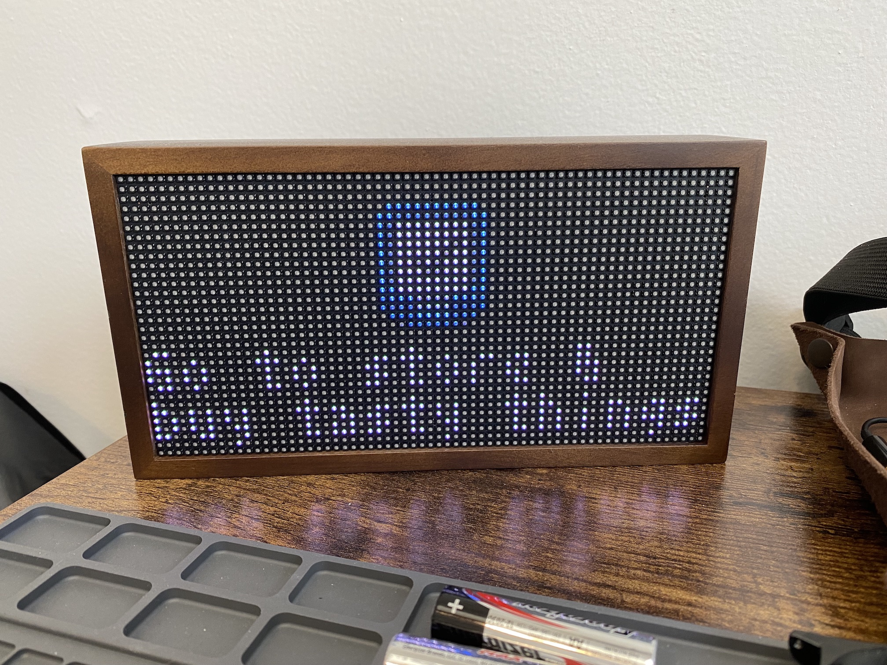

# Tidbyt Things
[Tidbyt](https://tidbyt.com/) integration with [Things app (Things3)](https://apps.apple.com/us/app/things-3/id904237743)

No I have not published the scripts here yet, currently just showing how it works.
 

I am on macOS and use the very popular Things app to help me stay on task through the day. I wanted to put my "Today" todo list on my tidbyt. Unfortunately, Things doesn't have an API for their cloud service, so I went a different route and used AppleScript to grab the data from Things, write to a .star file, and then set up a cron to render and push to the tidbyt. Here is the general way it works...

1. AppleScript
	- pull todo data from Things app
	- overwrite existing .star file with updated list items (current limit 3 items)
	- *option to write todo list to file*
2. things.star (or whatever you want to name it)
	- renders large app image with crossed circle for 0 items
	- renders small icon top center for 1 and 2 items
	- renders small icon left center for 3 items
	- *option for vertical scroll with 1 item layout as seen below for Upcoming List*
    
<i>Upcoming List with vertical scroll layout</i>

3. cron
	- shell script to run AppleScript and pixlet render webp
	- shell script to push webp to tidbyt
	- shell scripts set to run on certain hour intervals and 10 seconds apart

Things is on my tidbyt! The pictures do not do it justice, it looks great! 

# Rendered via localhost
| Today List None | Upcoming List None|
:-------------------------:|:-------------------------:
|  |  |

| Today List 1 Item | Upcoming List 1 Item |
:-------------------------:|:-------------------------:
|  |  |

# Pushed to Tidbyt

